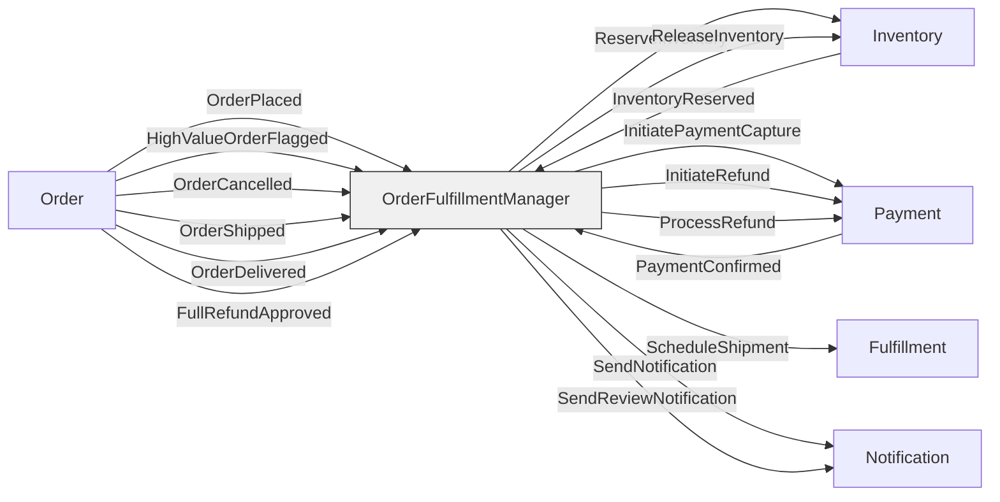
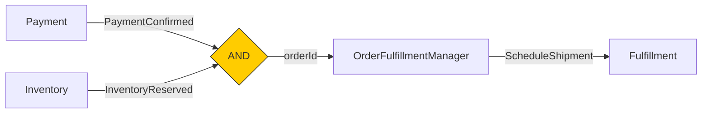

# UbiSpec — Derived Artifact Examples

Each artifact below is mechanically generated from the same UbiSpec YAML. No interpretation, no LLM — just structural transformation.

Source spec used for lifecycle examples:

```yaml
- When: ApproveRegistry
  And:
    - registry-is-submitted: "dm.state.status.kind === 'SubmittedForReview'"
    - reviewer-is-authorised: dm.ctx
    - no-unresolved-comments: dm.state
  Then:
    - RegistryApproved
    - PreviousRegistryArchived:
        - has-active-registry: "dm.ctx.currentActiveRegistryId != null"
  Outcome:
    _always:
      - state-is-active: om.state
      - effective-date-set: [om.state, dm.cmd]
      - approval-recorded: [om.evts, dm.cmd]
    PreviousRegistryArchived:
      - archival-target-correct: [om.evts, dm.ctx]
      - previous-deactivated: om.state
```

Source spec used for process examples:

```yaml
process: OrderFulfillmentManager
reacts_to: [Order, Payment, Inventory]
emits_to: [Inventory, Payment, Fulfillment, Notification]

reactions:
  - When: OrderPlaced
    From: Order
    Then:
      - ReserveInventory -> Inventory
      - InitiatePaymentCapture -> Payment

  - When:
      all:
        - PaymentConfirmed from Payment
        - InventoryReserved from Inventory
    correlate: orderId
    Then: ScheduleShipment -> Fulfillment

  - When: OrderCancelled
    From: Order
    Then:
      - ReleaseInventory -> Inventory
      - InitiateRefund -> Payment:
          - payment-was-captured: rm.ctx
      - SendNotification -> Notification
```

---

## 1. Decision Table

**Source:** Lifecycle UbiSpec, per command

One table per command. Columns are all evaluable conditions (constraints + event conditions). Rows are all meaningful scenarios. Output column shows which events fire.

### ApproveRegistry — Decision Table

| # | registry-is-submitted | reviewer-is-authorised | no-unresolved-comments | has-active-registry | → Events |
|---|:---:|:---:|:---:|:---:|---|
| 1 | ✓ | ✓ | ✓ | ✓ | RegistryApproved, PreviousRegistryArchived |
| 2 | ✓ | ✓ | ✓ | ✗ | RegistryApproved |
| 3 | ✗ | — | — | — | DecisionFailed [registry-is-submitted] |
| 4 | ✓ | ✗ | — | — | DecisionFailed [reviewer-is-authorised] |
| 5 | ✓ | ✓ | ✗ | — | DecisionFailed [no-unresolved-comments] |
| 6 | ✗ | ✗ | ✗ | — | DecisionFailed [registry-is-submitted, reviewer-is-authorised, no-unresolved-comments] |

**Reading the table:**
- Rows 1–2: success paths. All constraints pass. Event conditions determine which subset of events fire.
- Rows 3–5: single constraint failure. The `—` means the condition is not evaluated (short-circuit or irrelevant after failure).
- Row 6: all constraints fail. All failed names appear in the DecisionFailed payload.

**Generation rule:** Constraints are evaluated first (rows 3–6). Only when all pass are event conditions evaluated (rows 1–2). The number of success rows = 2^(number of conditional events). The number of failure rows = at minimum one per constraint, plus optionally one all-fail row.

---

## 2. Test Scenario Matrix

**Source:** Lifecycle UbiSpec, per command

Each row is a named test case with setup, action, and expected outcome. Directly feeds test implementation.

### ApproveRegistry — Test Scenarios

| ID | Scenario | Setup | Expected Events | Expected Outcome |
|----|----------|-------|-----------------|------------------|
| APR-01 | Happy path with archival | Registry is SubmittedForReview. Reviewer is national authority. No unresolved comments. Another registry is currently active. | RegistryApproved, PreviousRegistryArchived | State is Active. Effective date set. Approval recorded. Archival target correct. Previous deactivated. |
| APR-02 | Happy path without archival | Registry is SubmittedForReview. Reviewer is national authority. No unresolved comments. No other active registry. | RegistryApproved | State is Active. Effective date set. Approval recorded. |
| APR-03 | Rejected: not submitted | Registry is in Draft status. | DecisionFailed [registry-is-submitted] | State unchanged. |
| APR-04 | Rejected: unauthorised reviewer | Registry is SubmittedForReview. Reviewer is not a national authority. | DecisionFailed [reviewer-is-authorised] | State unchanged. |
| APR-05 | Rejected: unresolved comments | Registry is SubmittedForReview. Reviewer is national authority. Has unresolved comments. | DecisionFailed [no-unresolved-comments] | State unchanged. |

**Generation rules:**
- One happy path per combination of conditional event conditions (2 rows for 1 conditional event, 4 for 2, etc.)
- One failure row per constraint
- Setup is derived from constraint names (Level 1) or expressions (Level 4)
- Expected outcome is derived from Outcome section, keyed by which events fired
- Failure outcomes always assert "state unchanged"
- ID format: first 3 letters of command + sequential number

### OrderCancelled (Process) — Test Scenarios

| ID | Scenario | Trigger | Expected Commands | Conditions |
|----|----------|---------|-------------------|-----------|
| ORC-01 | Cancellation with refund | OrderCancelled, payment was captured | ReleaseInventory → Inventory, InitiateRefund → Payment, SendNotification → Notification | payment-was-captured: ✓ |
| ORC-02 | Cancellation without refund | OrderCancelled, payment was not captured | ReleaseInventory → Inventory, SendNotification → Notification | payment-was-captured: ✗ |

---

## 3. Validation Checklist

**Source:** Lifecycle UbiSpec, per command

For stakeholder sign-off. Each constraint and outcome is a checkbox item derived from the predicate name. No technical detail — just the behavioural contract in plain English.

### Registry Decider — Validation Checklist

**Command: ApproveRegistry**

Preconditions:
- [ ] Registry is submitted
- [ ] Reviewer is authorised
- [ ] No unresolved comments

On success:
- [ ] Registry is approved (always)
- [ ] Previous registry is archived (when there is an active registry)

After:
- [ ] State is active
- [ ] Effective date is set
- [ ] Approval is recorded
- [ ] If archival occurred: archival target is correct
- [ ] If archival occurred: previous registry is deactivated

On failure:
- [ ] A DecisionFailed is produced naming the failed preconditions
- [ ] No state change occurs

---

**Command: SubmitRegistry** _(illustrative — from a hypothetical full lifecycle)_

Preconditions:
- [ ] Registry is draft
- [ ] Has profiles
- [ ] All profiles have test entries

On success:
- [ ] Registry is submitted for review

After:
- [ ] State is submitted for review
- [ ] Submitted date is recorded
- [ ] Profiles are unchanged

On failure:
- [ ] A DecisionFailed is produced naming the failed preconditions
- [ ] No state change occurs

---

_Signed off by: _________________________ Date: _____________

**Generation rules:**
- Section per command, ordered as in the lifecycle
- Preconditions = And constraints, names converted from kebab-case to sentence case
- On success = Then events, annotated with "(always)" or "(when <condition-name>)"
- After = Outcome assertions, grouped by _always and event-keyed
- On failure section is identical for every command (the implicit failure convention)
- Footer with signature line (configurable template)

---

## 4. Traceability Matrix

**Source:** All Lifecycle and Process UbiSpec in a bounded context

Traces the relationship between commands, constraints, events, outcomes, and reactions. Every element is cross-referenced.

### Forward Trace: Command → Events → Reactions → Commands

| Command | Produces | Reacted to by | Dispatches |
|---------|----------|---------------|------------|
| ApproveRegistry | RegistryApproved | — | — |
| | PreviousRegistryArchived | — | — |
| PlaceOrder | OrderPlaced | OrderFulfillmentManager | ReserveInventory → Inventory |
| | | | InitiatePaymentCapture → Payment |
| | HighValueOrderFlagged | OrderFulfillmentManager | SendReviewNotification → Notification |
| CancelOrder | OrderCancelled | OrderFulfillmentManager | ReleaseInventory → Inventory |
| | | | InitiateRefund → Payment (conditional) |
| | | | SendNotification → Notification |

### Reverse Trace: Constraint → Commands Guarded

| Constraint | Used in |
|------------|---------|
| registry-is-submitted | ApproveRegistry |
| reviewer-is-authorised | ApproveRegistry |
| no-unresolved-comments | ApproveRegistry |
| registry-is-draft | CreateDraftRegistry, AddProfile, RemoveProfile, AddTestEntry |
| order-is-draft | AddLineItem, RemoveLineItem, PlaceOrder |
| has-lines | PlaceOrder |
| is-cancellable | CancelOrder |

### Event → Outcome Assertions

| Event | Assertions verified |
|-------|--------------------|
| RegistryApproved | state-is-active, effective-date-set, approval-recorded |
| PreviousRegistryArchived | archival-target-correct, previous-deactivated |
| OrderPlaced | state-is-placed, placed-at-recorded |
| OrderCancelled | state-is-cancelled, reason-recorded |

### Impact Analysis: "What breaks if we change X?"

_Example query: "What is affected if we remove the `reviewer-is-authorised` constraint?"_

| Element | Relationship | Impact |
|---------|-------------|--------|
| ApproveRegistry | Guarded by constraint | Constraint removed — command now accepts without authorisation check |
| DecisionFailed | References constraint name | Failure scenario APR-04 no longer exists |
| dm.ctx | Scope dependency | May be removable if no other constraint in this command uses dm.ctx |

**Generation rules:**
- Forward trace: scan all lifecycle Then → match event names in process When → follow Then to dispatched commands
- Reverse trace: scan all And sections for each constraint name
- Event → assertions: scan all Outcome sections, match by event key
- Impact analysis: given an element name, trace all references across all specs in scope

---

## 5. Aggregate Topology Diagram

**Source:** All Process UbiSpec in a system

Extracted from `reacts_to`, `emits_to`, `When`/`From`, `Then -> Target`. Pure graph structure.

### Mermaid Output



### Join Points (from `all` triggers)



### Alternative: Text Summary

```
OrderFulfillmentManager
  subscribes to:
    Order: OrderPlaced, HighValueOrderFlagged, OrderCancelled, OrderShipped, OrderDelivered, FullRefundApproved
    Payment: PaymentConfirmed (via AND join with InventoryReserved, correlate: orderId)
    Inventory: InventoryReserved (via AND join with PaymentConfirmed, correlate: orderId)
  dispatches to:
    Inventory: ReserveInventory, ReleaseInventory
    Payment: InitiatePaymentCapture, InitiateRefund, ProcessRefund
    Fulfillment: ScheduleShipment
    Notification: SendNotification, SendReviewNotification
```

**Generation rules:**
- Nodes = unique decider names across all reacts_to and emits_to
- Process manager nodes = process names (styled differently)
- Inbound edges = When/From pairs, labeled with event name
- Outbound edges = Then targets, labeled with command name
- AND joins = `all` triggers rendered as convergence points with correlation key annotation
- Output as Mermaid, GraphViz DOT, PlantUML, or JSON adjacency list

---

## 6. Integration Dependency Manifest

**Source:** All `dm.ctx` and `rm.ctx` references across all UbiSpec

Every ctx reference is a declared external dependency. Scan and catalogue.

### Per-Command Shell Dependencies

| Decider | Command | Dependency | Scope | Resolution Hint |
|---------|---------|------------|-------|-----------------|
| Registry | ApproveRegistry | reviewer-is-authorised | dm.ctx | AuthorityService.check(dm.cmd.reviewedBy) |
| Registry | ApproveRegistry | has-active-registry | dm.ctx | RegistryReadModel.findActive(dm.state.area) |
| Registry | SubmitForReview | all-profiles-complete | dm.ctx | ProfileValidationService.validateAll(dm.state.profiles) |
| Laboratory | ActivateLaboratory | facility-exists | dm.ctx | FacilityRegistry.lookup(dm.cmd.facilityRegistryId) |
| Order | PlaceOrder | all-products-in-stock | dm.ctx | InventoryService.checkAll(dm.state.lines) |
| Order | PlaceOrder | high-value | dm.ctx | PricingService.calculateTotal(dm.state.lines) |

### Per-Reaction Shell Dependencies

| Process | Trigger | Dependency | Scope | Resolution Hint |
|---------|---------|------------|-------|-----------------|
| AssessmentLifecycleManager | AssessmentAdjusted | adjusted-profile-exists | rm.ctx | RegistryReadModel.profileExists(rm.event.adjustedProfileId) |
| AssessmentLifecycleManager | AssessmentCancelled | has-active-assignment | rm.ctx | LaboratoryReadModel.findById(rm.event.laboratoryId) |
| OrderFulfillmentManager | OrderCancelled | payment-was-captured | rm.ctx | PaymentReadModel.isCaptured(rm.event.orderId) |

### Service Dependency Summary

| External Service | Used by Commands | Used by Reactions |
|-----------------|-----------------|-------------------|
| AuthorityService | ApproveRegistry | — |
| RegistryReadModel | ApproveRegistry | AssessmentAdjusted |
| FacilityRegistry | ActivateLaboratory | — |
| InventoryService | PlaceOrder | — |
| PricingService | PlaceOrder | — |
| ProfileValidationService | SubmitForReview | — |
| LaboratoryReadModel | — | AssessmentCancelled |
| PaymentReadModel | — | OrderCancelled |

**Generation rules:**
- Scan all predicate values for `dm.ctx` or `rm.ctx` (at any level — scope annotation or expression)
- Extract `# shell:` comments for resolution hints
- Group by command/reaction, then by external service
- At Level 2 (scope only): the dependency is known but the resolution hint is absent
- At Level 4 (expression): the full ctx path reveals the expected data shape

---

## 7. Command Catalog

**Source:** All Lifecycle UbiSpec in the system

Flat index of every command the system accepts.

### System Command Catalog

| # | Decider | Command | Constraints | Events (success) | Conditional Events | Has ctx? | Reacted to? |
|---|---------|---------|:-----------:|:----------------:|:-----------------:|:--------:|:-----------:|
| 1 | Registry | CreateDraftRegistry | 2 | 1 | 0 | ✗ | ✗ |
| 2 | Registry | AddProfile | 3 | 1 | 0 | ✗ | ✗ |
| 3 | Registry | RemoveProfile | 3 | 1 | 0 | ✗ | ✗ |
| 4 | Registry | SubmitForReview | 3 | 1 | 0 | ✓ | ✗ |
| 5 | Registry | ApproveRegistry | 3 | 1 | 1 | ✓ | ✗ |
| 6 | Registry | RejectRegistry | 2 | 1 | 0 | ✓ | ✗ |
| 7 | Laboratory | RegisterLaboratory | 2 | 1 | 0 | ✓ | ✗ |
| 8 | Laboratory | ActivateLaboratory | 2 | 1 | 0 | ✓ | ✗ |
| 9 | Laboratory | AssignProfile | 3 | 1 | 0 | ✗ | ✓ |
| 10 | Laboratory | UpdateAssignment | 2 | 1 | 0 | ✗ | ✓ |
| 11 | Laboratory | WithdrawAssignment | 2 | 1 | 0 | ✗ | ✓ |
| 12 | Order | CreateOrder | 1 | 1 | 0 | ✗ | ✗ |
| 13 | Order | AddLineItem | 3 | 1 | 0 | ✗ | ✗ |
| 14 | Order | PlaceOrder | 3 | 1 | 1 | ✓ | ✗ |
| 15 | Order | CancelOrder | 2 | 1 | 1 | ✗ | ✗ |

### Summary Statistics

```
Total commands:     15
Total deciders:      3
Commands with ctx:   6 (40%) — these require shell integration
Conditional events:  3 commands have branching logic
Reacted to:          3 commands are dispatched by process managers (not user-initiated)
```

**Generation rules:**
- One row per command per decider
- Constraint count = length of And array
- Event count = count of unconditional Then entries
- Conditional event count = count of Then entries with conditions
- Has ctx = any predicate in And, Then conditions, or Outcome references `dm.ctx`
- Reacted to = command name appears in any Process UbiSpec Then section
- Statistics computed from the table

---

## Comparison: Effort vs Impact

| Artifact | Build difficulty | Audience | Frequency of use | Impact |
|----------|:---:|---|---|---|
| Decision Table | Low | BA, QA, Developers | Per command, per review | ★★★★★ |
| Test Scenario Matrix | Low | QA, Developers | Per sprint, per feature | ★★★★★ |
| Validation Checklist | Very low | Client, Product Owner | Per milestone, sign-off | ★★★★☆ |
| Traceability Matrix | Medium | Compliance, Architects | Per release, per audit | ★★★★☆ |
| Topology Diagram | Low | Architects, New joiners | Per system change | ★★★☆☆ |
| Integration Manifest | Low | Architects, DevOps | Per integration planning | ★★★☆☆ |
| Command Catalog | Very low | Everyone | Reference, onboarding | ★★☆☆☆ |